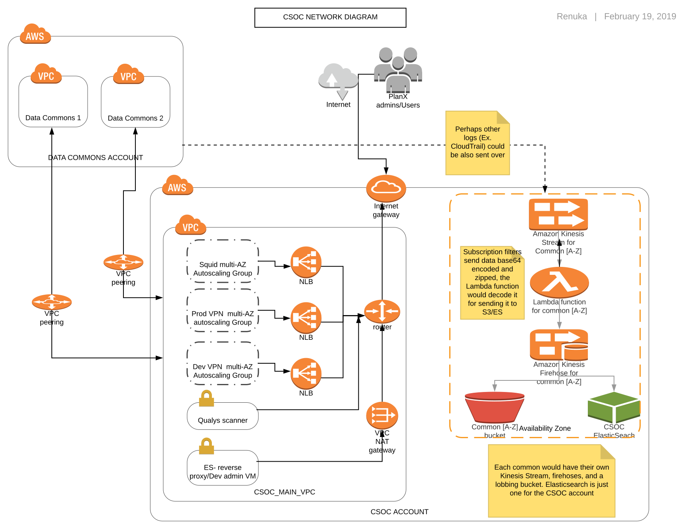

CDIS uses a Commons Services Operations Center (CSOC) AWS account for accessing the AWS accounts associated with all of the Gen3 commons they operate. Operators of other Gen3 data commons may choose to have a separate CSOC account or operate their Gen3 data commons within the same AWS account. There are two major functionality associated with the CSOC account:

## A. CSOC Logging
Centralize logging for all commons in other AWS accounts.

https://github.com/uc-cdis/cloud-automation/blob/master/tf_files/aws/modules/common-logging/README.md

## B. CSOC Centralized Management VPC
CDIS launched  `csoc_main_vpc [CIDR - 10.128.0.0/20]`, using a vpc wizard with two subnets - `csoc_main_vpc_pub1 [ public subnet - 10.128.1.0/24]` and `csoc_main_vpc_priv1 [private subnet - 10.128.2.0/24]` in the AWS CSOC account.

## Components of CSOC VPC:

	1.	OpenVPN server VM
	2.	Admin VM for the CSOC account
	3.	Admin VM for data commons account
	4.	Squid Proxy VM
	5.	VPC Peering

## 1. VPN server VM

Two VPN servers were configured on an CSOC. Dev VPN gives access to the admin VM for our development environments. Prod VPN gives access to admin VM for production environments. To access controls for a particular environment a user must be able to authenticate to the VPN, and also have ssh access to the admin vm.

## 2. Admin VM for the CSOC account

A master admin VM is launched in the CSOC account which is used to do all the OPS related task in CSOC including spinning up admin VMs for data commons, spinning up new data commons etc.

`gen3 workon csoc csocmaster_adminvm`

## 3. Admin VM for data commons account

Each data commons account is  associated with an admin VM. The purpose of the admin VM is to manage the data commons VPC from the CSOC account. An admin VM can be launched in the CSOC account as:

`gen3 workon csoc <commons name>_adminvm`

Once launched it can be accessed on private ip [10.128.x.y]  via the  CSOC VPN. Each admin VM can only communicate with the associated data commons account's VPCs.
The routing is done via the VPC peering [ explained below] between the CSOC and the data commons VPC. CSOC squid proxy is configured for internet access. The access is limited at the security group level. Each admin VM have specific security group rules attached to it.
* ssh_* - This only allows the inbound ssh traffic from anywhere.
* local_* - This allows the ingress traffic from the CSOC VPC CIDR and the egress traffic to the CSOC VPC CIDR, VPC CIDR of the associated VPC and the AWS cloudwatch subnet.

## 4. Squid Proxy VM

A squid proxy is needed for internet connectivity for the admin VM. It is a one time thing and rather a permanent resource. It can be created as:

`gen3 workon csoc csocmain_squidvm`

 We do not want the admin VM be able to talk to any VPC other than the VPCs associated with its data commons account. This was achieved by appropriate security group rules (described above) and the internet traffic going via the squid proxy. Once the Squid proxy is launched, make sure an entry is added in the Route 53 for cloud-proxy.internal.io pointing to the private IP address of the squid proxy.

## 5. VPC Peering

`gen3 workon csoc <commons_name>`

A VPC peering connection is used for the communication between the admin VM in the CSOC and the associated data common VPCs.
1.  A VPC peering request is made when the data commons VPC is spun up (appropriate routes from the data commons VPC to the CSOC VPC via the VPC peering connection  are created in the data commons route tables). Please note that the `gen3 tfapply` fails when you first run it for the VPC. CSOC admin needs to accept the peering and then run `gen3 tfplan` and `gen3 tfapply` again.

2. VPC peeing acceptance can be done manually or via the script as follows:
* Automatic process: We need to login to the csoc_admin VM and run the following command:

  `gen3 approve_vpcpeering_request <child_vpc_name>`

  The underneath script basically looks for a new VPC peering request, if there is a request in a pending state, it is accepted, tagged and  an appropriate route to the csoc_main_vpc private subnet route table is added. This script accepts an optional flag `--get-route-table` which programmatically gets the route table id(s) of the VPC which is accepting the peering request.

*  Manual Process: Once the VPC Peering connection request is made, the CSOC admin need to do the following (use this process only if `automatic process` explained above give errors):
	*	Verify the VPC  peering request and accept it. Make sure the VPC peering connection is active. At this time you can give a name to the peering connection for future reference.
	*	Add a route in the  route table associated to the private subnet - `Destination - Data commons VPC CIDR` & `Target - VPC peering connection`.
