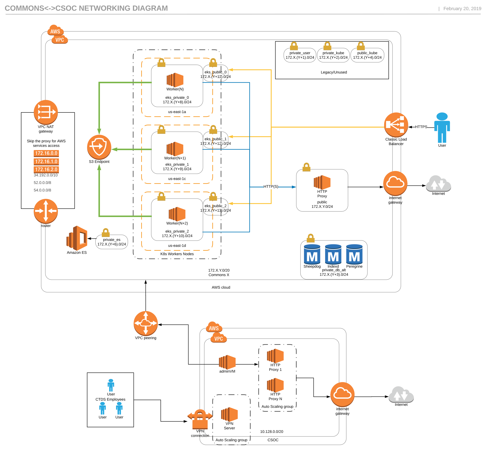

# TL;DR

This code supports automation of several PlanX processes:

* `./tf_files` - terraform infrastructure automation - for creating resources in the cloud
like databuckets, networks, databases, and kubernetes clusters
* `./kube` - kubernetes automation - for deploying services, configuration, secrets, and jobs
to a kubernetes cluster
* `./Docker` - image automation - for building various Docker images including *Jenkins* and *devterm*
* `./Jenkins` - Jenkins pipelines - for automating workflows like backing up the Jenkins server, testing the *cloud-automation* repo, and continuously deploying to the *QA* environments
* `./gen3` - user friendly tools to simplify workflows with the `./kube` kubernetes and `./tf_files` terraform automation - [more details](./gen3/README.md)
* `./doc` - [gen3 help](./doc/README.md) docs

The repository also interacts closely with the [images](https://github.com/uc-cdis/images)
and [cdis-manifest]

# Table of contents

- [1. TL;TR](#tldr)
- [2. Independent Setup](#independent-setup)
- [3. Workflows](#workflows)
  - [3.1 AWS CSOC](#aws-csoc)
  - [3.2 New account flow](#new-account-flow)
  - [3.3 New adminVM](#new-adminvm)
  - [3.4 New commons flow](#new-commons-flow)
  - [3.5 Prerequisites for Commons](#prerequisites-for-commons)


# Independent Setup

There are a couple of ways you can build up a commons. The one we call CSOC free and the other attached to a CSOC account.

CSOC stands for Commons Services Operations Center, which is a term used internally to refer to our centralized operation center for multiple commons. Visit [CSOC_Documentation.md](https://github.com/uc-cdis/cloud-automation/blob/master/CSOC_Documentation.md) for more information.

For third party installs, the CSOC free is recommended. Commons attached to a CSOC account would be justified when managing multiple commons, where keeping up with daily tasks may become a little cumbersome.

For setup instructions, please visit [csoc-free-commons-steps.md](https://github.com/uc-cdis/cloud-automation/blob/master/doc/csoc-free-commons-steps.md).


# Workflows

## AWS CSOC

Most of our interaction with CDIS AWS accounts occur via the central CDIS CSOC account.
[This page](https://github.com/uc-cdis/cdis-wiki/blob/master/ops/CSOC_Documentation.md) describes the CSOC architecture

## New account flow

* Create an `csoc_adminvm` role in the new account with a trust relationship that allows
the CSOC account to create roles that can assume the `csoc_adminvm` role in the new account:
```
{
  "Version": "2012-10-17",
  "Statement": [
    {
      "Effect": "Allow",
      "Principal": {
        "AWS": "arn:aws:iam::433568766270:root"
      },
      "Action": "sts:AssumeRole",
      "Condition": {}
    }
  ]
}
```

* Create a new `admin-vm` in the CSOC.  An administrator logs into an account's admin-vm to interact with the account's AWS API and kubernetes clusters:
    - connect to the CSOC VPN (requires multi-factor authentication)
    - ssh to the adminvm
Contact CDIS ops team to request access to the CSOC VPN, and to add your ssh public key to the
appropriate adminvm.

## New adminVM

Admin VMs are used to communicate against the remote account from the CSOC account.

1. SSH into CSOC master VM
```
Host csoc
   ServerAliveInterval 120
   HostName 10.128.2.252
   User ubuntu
   ForwardAgent yes
```

2. Access the cloud-automation folder and update if necessary:
```
$ cd cloud-automation
$ git checkout master
$ git pull
```

3. Invoke gen3 to use the utilityVM module
```
$ gen3 workon csoc <name of account>_utilityvm
```

4. Make the necessary changes to the config.tfvars

```
$ gen3 cd
$ cat config.tfvars
bootstrap_path = "cloud-automation/flavors/adminvm/"
bootstrap_script = "init.sh"
vm_name = "cdistest_admin"
vm_hostname = "cdistest_admin"
vpc_cidr_list = ["10.128.0.0/20", "52.0.0.0/8", "54.0.0.0/8", "172.24.48.0/20", "172.24.64.0/20", "172.24.192.0/20", "172.24.208.0/20"]
extra_vars = ["account_id=707767160287"]
environment = "cdistest"
instance_type = "t2.micro"
aws_account_id = "707767160287"
```

Generally speaking, the `bootstrap_path` and `bootstrap_script` vars shouldn't need any change unless you want to use a custom one.
Variables explanation:
- vm_name: self explanatory.
- vm_hostname: hostname to be used by the VM, usually the same as the name. But you could use a domain if you wanted to.
- vpc_cidr_list: CIDRs where the VM would have egress access.
- extra_vars: variables that will be used by `bootstrap_script`. For the above example, we are telling it to use the remote account ID, in which case will be used to set up awscli `/home/ubuntu/.aws/config`.
- environment: for tagging purposes.
- instance_type: the size of the VM.
- aws_account_id: the remote account ID that this VM will have access to.


5. Apply the module against AWS
```
$ gen3 tfplan
```

Check that it looks good and it'll do what you are expecting it to do.

```
$ gen3 tfapply
```

The output should show you the new VM's IP. Please make sure to update https://github.com/uc-cdis/cdis-wiki/blob/master/ops/AWS-Accounts.md when it's done.


## New commons flow

The CDIS ops team follows this flow to create a new commons.

* Before creating a new commons, you must bring up the logging portion in the CSOC account. To achieve this, ssh into the CSOC master VM.
```
$ gen3 workon csoc <name of account>_logging
$ gen3 cd
$ sed -i 's/NUMERIC-ID/<account-id>/g' config.tfvar
$ gen3 tfplan
$ gen3 tfapply
```

* Login to the adminvm, if this is a brand new account that requires a new adminVM, please see previous step.
* Create a user account for the commons.  There is one `admin-vm` per AWS account.  We create one `user` on an account's admin-vm for each commons VPC under the account.
Note that an `adminvm` acquires credentials to interact with the AWS API via the EC2 metadata service.  For example, user accounts on the `cdistest` admin-vm have the following configuration:
```
$ cat ~/.aws/config
[default]
output = json
region = us-east-1
role_arn = arn:aws:iam::707767160287:role/csoc_adminvm
credential_source = Ec2InstanceMetadata

[profile cdistest]
output = json
region = us-east-1
role_arn = arn:aws:iam::707767160287:role/csoc_adminvm
credential_source = Ec2InstanceMetadata
```

* Login to the commons account - ex: `ssh commons@account-admin-vm.csoc`
* Run terraform to bring up a VPC to host the commons:
```
$ gen3 workon <account-profile> <commons-name>
$ gen3 cd
$ configure VPC CIDR in `config.tfvars`
$ gen3 tfplan
$ gen3 tfapply
```
* Copy the commons config files to the home directory: `cp {VPC_NAME}_output ~/{VPC_NAME}_output`
* Run `kube-aws` (via the `kube-up` command)
```
cd ~/{VPC_NAME}_output
bash kube-up.sh
```
* Bring up the commons
```
source ~/.bashrc
edit ~/{VPC_NAME}/00configmap.yaml
edit ~/{VPC_NAME}_output/creds.json
gen3 roll all
```


### Network Diagram

The following diagram intends to illustrate the network and basic communications between CSOC and a commons account.




## Prerequisites for Commons


#### Google OAUTH credentials

We register each commons (going forward) as an OAuth client of the `cdis-test` project
under the `planx-pla.net` GCP domain (organization).  Contact the CDIS *ops*
team to request a Google client-id and secret for a new commons to support *"Login with Google"*.

- [Create a Google project](https://console.developers.google.com/projectcreate?previousPage=%2Fprojectselector%2Fapis%2Fapi%2Fplus.googleapis.com%2Foverview) with the project name you want to use.
- Enable the Google+ API after you create your project, the link above should take you there after project creation.
- Click "Create Credentials" choose the "Google+ API", then choose "Web server" as API from, and choose "User data" as the data being accessed.
- For the "Authorized JavaScript Origins" enter just the hostname like `https://data.examplecommons.org`.
- For the "Authorized redirect URIs" enter `hostname + '/user/login/google/login/'` so for example `https://data.examplecommons.org/user/login/google/login/`.
- Download your credentials with contain the `client_id` and `client_secret`.

#### Configure certificate for your domain

For AWS, use the certificate manager to either import the certs or request admin for the domain to allow AWS to generate certs. The domain should match the hostname you configured in Google or the parent domain name.

#### Using the automated scripts

We have two automation scripts:

* [gen3](https://github.com/uc-cdis/cloud-automation/blob/master/gen3/README.md) supports our terraform-based infrastructure automation
* [g3k]

#### Create customized AMI

The latest versions of the customized ubuntu 16.04 AMI's required by the terraform automation
are published as public images under the AWS `cdis-test` account.
Build new AMIs using [images](https://github.com/uc-cdis/images).
