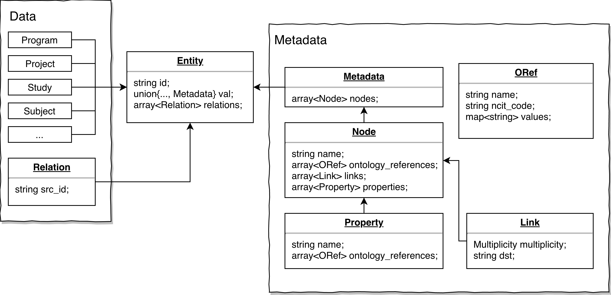
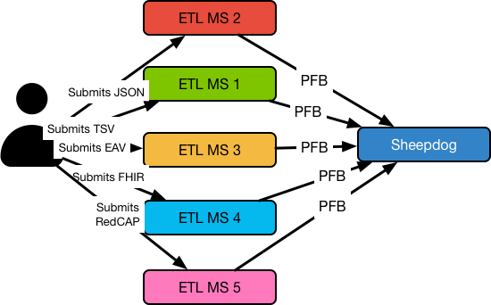

# Portable Format for Biomedical Data

[JIRA Epic][1]

- [Portable Format for Biomedical Data](#portable-format-for-biomedical-data)
  - [What is PFB?](#what-is-pfb)
  - [Glossary](#glossary)
  - [PFB schema specification](#pfb-schema-specification)
  - [Explanation about ontology references:](#explanation-about-ontology-references)
  - [Use cases](#use-cases)
    - [Data modeling changes](#data-modeling-changes)
    - [Dump a project from a Commons to another one](#dump-a-project-from-a-commons-to-another-one)
    - [Transfer virtual cohorts between commons](#transfer-virtual-cohorts-between-commons)
    - [Dumps for indexing into commons](#dumps-for-indexing-into-commons)
    - [Schema changes in a single commons](#schema-changes-in-a-single-commons)
    - [Versioning of data](#versioning-of-data)
    - [Data submission transformation](#data-submission-transformation)
  - [Indicators for choosing serialization formats](#indicators-for-choosing-serialization-formats)
  - [Relevant links](#relevant-links)

## What is PFB?

**PFB** = Portable Format for Biomedical data

*PFB* contains clinical data and metadata (which stores the ontology references).

*PFB* is using *Avro* for serialization. *Avro* schema specifies the data model.

## Glossary

| Term | Definition |
|:--|:--|
| PFB | Portable Format for Biomedical data |
| PFB schema | Avro schema specification for PFB |
| PFB file | Data & ontology serialized in a file with PFB schema |
| Avro | Underline serialization format for PFB |
| record | Node specification |

## PFB schema specification



PFB is not a new serialization format, it's a specification of how to use a widely accepted serialization format for storing and transferring biomedical data efficiently.

Example Avro IDL schema that contains a subset of KF dictionary:

```
protocol PFB {
  record Program {
    string name;
    string id;
  }
  enum AvailabilityType {
    OPEN,
    RESTRICTED
  }
  record Project {
    string code;
    string name;
    string availability_mechanism;
    AvailabilityType availability_type;
    boolean released;
  }
  enum IndexDate {
    Diagnosis,
    First_Patient_Visit,
    Study_Enrollment
  }
  enum YesNo {
    Yes,
    No
  }
  enum State {
    uploading,
    uploaded,
    md5summing,
    md5summed,
    validating,
    error,
    invalid,
    suppressed,
    redacted,
    live,
    validated,
    submitted,
    released
  }
  record Participant {
    string consent_type;
    union{null, string} created_datetime;
    long days_to_lost_to_followup;
    string disease_type;
    string external_id;
    string family_id;
    string id;
    IndexData index_date;
    boolean is_proband;
    YesNo lost_to_followup;
    string primary_site;
    string project_id;
    State state;
    union{null, string} submitter_id;
    string type;
    union{null, string} updated_datetime;
  }
  record Relation {
    string src_id;
    string src_name;
  }
  enum Multiplicity {
    ONE_TO_ONE,
    ONE_TO_MANY,
    MANY_TO_ONE,
    MANY_TO_MANY
  }
  record Link {
    Multiplicity multiplicity;
    string dst;
  }
  record OntologyRef {
    string name;
    string code;
    map<string> values;
  }
  record Property {
     string name;
     array<OntologyRef> ontology_references;
  }
  record Node {
    string name;
    array<OntologyRef> ontology_references;
    array<Link> links;
    array<Property> properties;
  }
  record Metadata {
    array<Node> nodes;
  }
  record Entity {
    string id;
    union{Program, Project, Demographic, Metadata} val;
    array<Relation> relations;
  }
}
```

Each PFB file will store an arbitrary number of `Entity`s.

The PFB can be used as the source of truth for the bio metadata. Each version of the graph is represented in PFB. Hadoop and Spark has native support for Avro, so we can write efficient ETL between PFB and current GDC graph database.

This gives us multiple advantages:

1. Doing data transformation is much more efficient in Spark, we can standardize the data transformation process for GDC data migration process to be more explicit, robust and efficient.
2. Representing the metadata in a language-neutral and platform-neutral way gives us more potential to explore different database solutions and tech stacks.
3. It also opens the possibility to exchange data projects among different data repositories/data commons with a standardized protocol.
4. We can leverage the power of spark to do user metadata submission asynchronously and improve both the performance and user experience.

## Explanation about ontology references:

The example schema above shows how data references to ontology resources. There are multiple type of variables that can point to ontology references: Entity, Entity Attribute, Entity Relationships, Entity Attribute's Enums.

A project represented in PFB can describe data in different terms but reference the same ontology identifier. The data submission process can harmonize the schema based on ontology references so that it reduces the effort from submitters to manually map the terms to GDC terms.

## Use cases
### Data modeling changes
A data submitter would like to submit a new node type, they should be able to:
1. go to a data model website, create a new node with a bunch of fields
2. a curator go to a data model requests queue page and review the change requests, approve/reject them.
3. If it's a backward-compatible change, they can click the button to apply it to Commons
4. If not, the change will be scheduled for next maintenance window.

or

A data submitter would like to submit data they have in an existing system:
1. He/She converts an export of the existing data into PFB
2. He/She submits the data to a data commons, which automatically detects new enum values, fields, and nodes. The changes are queued for approval by a curator.
3. The data model curator approves or rejects each individual change, and the feedback is then provided to the data submitter. Changes are automatically flagged as being similar to existing values to improve usability for the curator around things such as typos or missing fields in existing nodes.

### Dump a project from a Commons to another one
A Commons operator want to move a project from one Commons to another Commons:
1. He/She go to Commons A, select a project, he/she can see recent project snapshot dumps, if he wants a snapshot of fresh data, he can click a button to request it and the Commons asynchrounously generates it and push to s3. The person then download the snapshot.
2. He/She go to Commons B, use the normal submission system to upload the project snapshot, if the schema for this project snapshot matches a subset of this Commons' schema, the data will be imported asynchrounously. If not, it will automatically submit a change request to the queue and wait for data curator to approve.

### Transfer virtual cohorts between commons
A commons user would like to create a cohort of cases from several projects on our commons and transfer it to a cloud resource for computation:
1. He/She go to Commons A, selects a virtual cohort, and exports to PFB.
2. The PFB is likely saved to S3/GCS and not actually touched by the user.
3. The path to the PFB is passed to Commons B, which then imports the PFB into its workspace.

Commons B expects the order in which the data should be loaded to be specified by the PFB.

### Dumps for indexing into commons
A commons operator may want to provide all of the data contained within a commons to a 3rd party for ETLing into other forms for search and discovery:
1. Commons A will provide dumps of all data and schema on a regular schedule, e.g. nightly.
2. Commons B will download the PFB dumps and use them to ETL into ElasticSearch
3. Commons C will download the PFB dumps and use them to ETL into BigQuery
4. Commons D will download the PFB dumps and use them to ETL into RedShift
5. Commons E will download the PFB dumps and use them to ETL into ElasticSearch with a different index structure than Commons B.

### Schema changes in a single commons
A commons operator may wish to perform a stable migration of data from A->B states:
1. The commons operator exports a project or all projects as PFB.
2. The PFB is converted from A->B by renaming a field in a single node, or by renaming a project, etc.
3. The commons operator wipes all existing data and imports the PFB completing the migration from the A state to the B state.

### Versioning of data
A commons operator may wish to keep versions of data in a dump format that can be utilized later:
1. The commons dumps all data to PFB after each data release and stores it in S3/GCS for long term archiving.
2. A PFB from a previous version can be restored into a new commons or overwriting data in an existing commons if necessary.
3. A PFB from a previous version can be updated to match a new schema and then made live in a commons.

### Data submission transformation
A commons operator wants to support many types and formats for core data submission, but wants to maintain a stable commons service. The commons operator therefore wishes to deploy API endpoints for submitting different types of data which can be self contained in different microservices. So users submitting FHIR data will not break users submitting JSON data. These data submission formats can then be viewed as plugins for a commons where they may also be developed by 3rd parties for supporting data transformation into PFB.



## Indicators for choosing serialization formats
Driven from the use cases, we are looking at those aspects when we choose the serialization format:
1. Good technical documentation
2. Well supported and robust libraries for serialization and deserialization for web api development and big data analytic platforms (spark).
3. Support conversion to a human readable format like JSON.
4. Easy to do schema evolution, preferably do not require code generation for each schema change.
5. Has schema definitions and basic data structures like array, struct, etc.
6. Good community acceptance.


## Relevant links

* [SuperComputing demo plan][2]
* [SuperComputing presentation][3]
* [SuperComputing screencast][4]
* [Internal PFB demo presentation][5]


  [1]: https://jira.opensciencedatacloud.org/browse/PXD-794
  [2]: https://paper.dropbox.com/doc/PFB-demo-plan-eiueGuwUu9FpPb5qbbtJH
  [3]: https://docs.google.com/presentation/d/1u618EmH5mhtInUu3flzCeTgswypqwEeF-eV2Gvqq2tU/edit?usp=sharing
  [4]: https://drive.google.com/open?id=1X7kMjQgTfxLUUd9wqGnGK6tm0U6KY5Gf
  [5]: https://docs.google.com/presentation/d/12DWezz7Z35-hCjdsGrCCh4cxC8mtUbjGbPfpsobldOE/edit?usp=sharing
