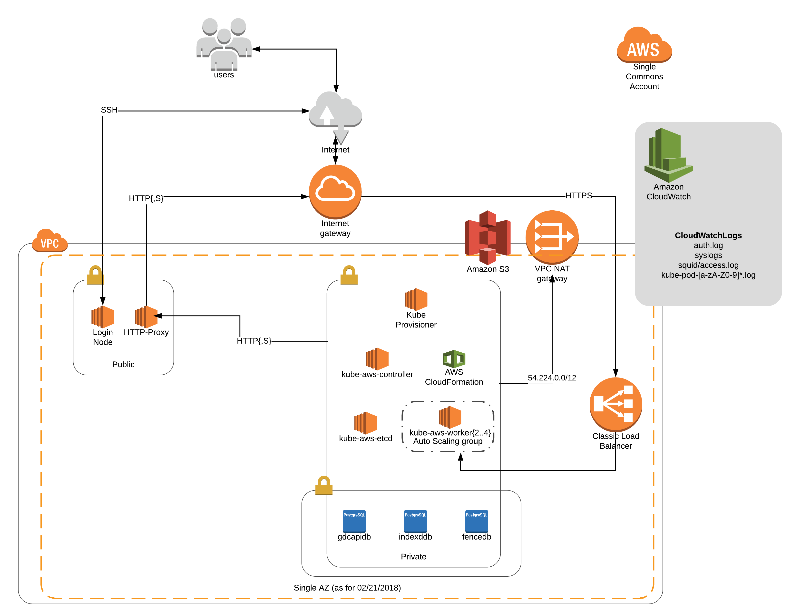

# High level structure

The protected cloud environment setup by cloud-automation currently have  5 subnets.
- a public subnet with internet gateway attached to it, there are currently a login VM and a squid proxy VM on it.
- a public subnet that has gateways for external facing services. Right now there is one ELB that routes traffic to services inside k8s cluster.
- a private subnet dedicated for k8s cluster which runs all Gen3 services.
- a private subnet for users to run analysis.
- a redundant private subnet for future multi-az setup.
- a NAT gateway that allows overpassing the proxy for logs.us-east-1.amazonaws.com requests.
