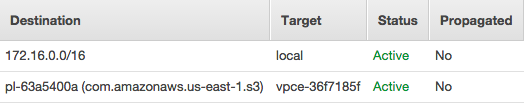
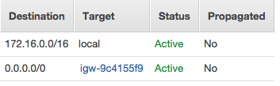

# High level structure
The private cloud we set up for users has  two subnets, a public subnet with internet gateway attached to it, and a private subnet without internet gateway. We setup a login VM and a http proxy VM under public subnet. All user VMs are spawned under pirvate subnet. Users ssh onto private VMs from the login VM, and use http proxy to connect to internet.

# How network rules are configured
## route tables
For each individual subnet, a route table is created to define how network traffic is directed.

The private route table defines two routes: 

1. any traffic within the VPC is covered by local route.
2. any traffic to S3 uses VPC endpoint.

The public route table defines two routes:

1. any traffic within the VPC is covered by local route.
2. any traffic to public internet uses internet gateway.

## security groups

