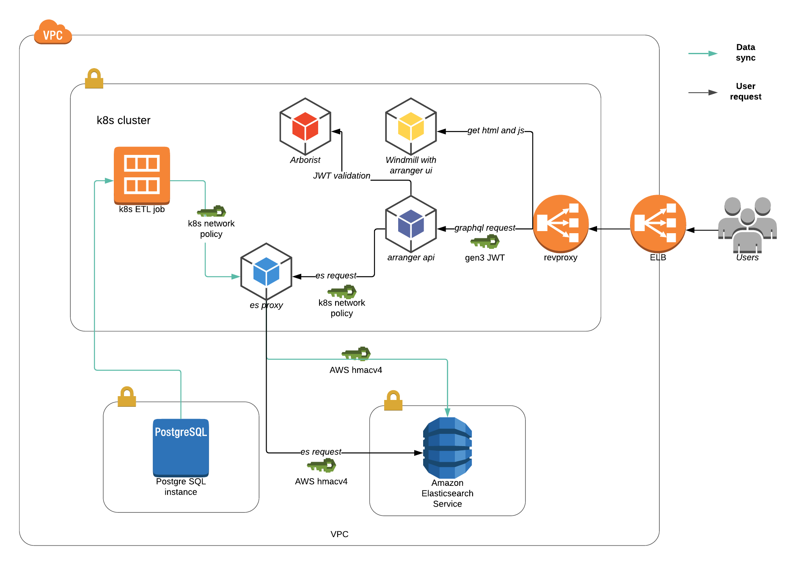

# Data Explorer
## Use case
General users want a search page in gen3 windmill to browse the metadata. Gen3 metadata is currently kept as a complicated and normalized relational model in postgres as a source of truth, and we have custom built shinyR app that store flat metadata table in memory and expose a faceted search interface. We need to replace the shiny app with a more robust and generalized solution that can be applied to all commons. For fast search capability, we would like to expose a flat view of the data powered by elasticsearch search engine.

## Technical Slides
https://docs.google.com/presentation/d/1-Bl9adgDvRH7Cj2pC876Zm1D2OjSOtApIfpfNgKeVls/edit?usp=sharing

## System architecture

[lucichart link](https://www.lucidchart.com/invitations/accept/a3aba1c1-e614-4538-9b1b-4d2885f8a10c)

## Query flow
1. user makes a graphql request with a jwt token
2. the request is routed to arranger api
3. gen3 auth middleware installed in arranger api sends a call to arborist with the jwt token, get back a list of authorized resources ( example [middleware](https://github.com/kids-first/kf-arranger/tree/master/src/middleware) )
4. gen3 auth middleware adds the filter for the project list to es query
5. arranger api sends the es query to es proxy
6. the es proxy sends the es query to es with hmac4 signature
7. response forwarded back to user

## components
### es proxy
a container(https://github.com/abutaha/aws-es-proxy) deployed in the gen3 k8s cluster, has aws keypair attached to the pod, the aws keypair should be generated during es automation and have read write access to es.
the k8s network policy should be configured to allow only the arranger api (and later etl job) to access the proxy
### arranger api
a container that runs the arranger api nodejs app. configured to use es proxy as the es endpoint
### windmill
gen3 portal that installs arranger ui component, generates javascript and html, the javascript in user's browser will make graphql calls to arranger api endpoint. The browser has access_token in the cookie and the reverse proxy translates that to Authorization header

#### Future UI Considerations
These are UI notes from a 9/13/18 meeting regarding deploying the Data Explorer to production. We should change and add these features in the future, based on user feedback.
1. Add a color block to the pie chart legend
2. Make the page (and overall site) more responsive.
4. Reduce the whitespace and height of charts to make the table higher up on the page and more visible.
5. Pass Arranger some sort of score for each value of each variable so that they are sorted a specific way in the aggregations panel.
6. Potentially add error pages instead of just displaying no data.

### ETL
etl process to transform graph datamodel in postgres to elasticsearch json document. First phase is only case view ETL. The process should be configuration driven, given the data model dictionary and a mapping between the dictionary to es schema, it should run the job to transform the data and load to ES.
### Arborist
authorization evaludation engine. Responsible for jwt validation and provide authorization information back to arranger api microservice.

