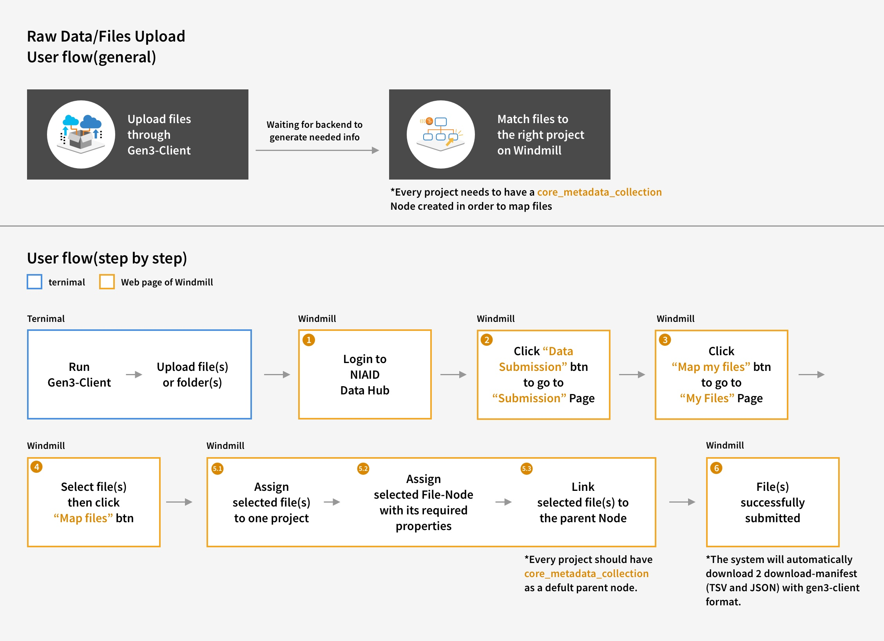
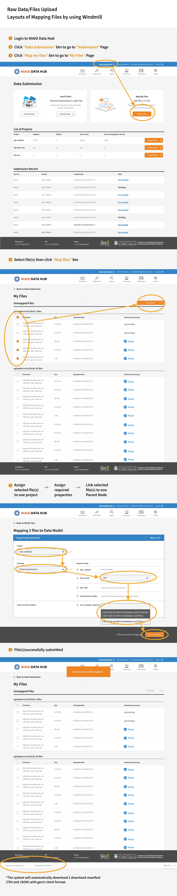
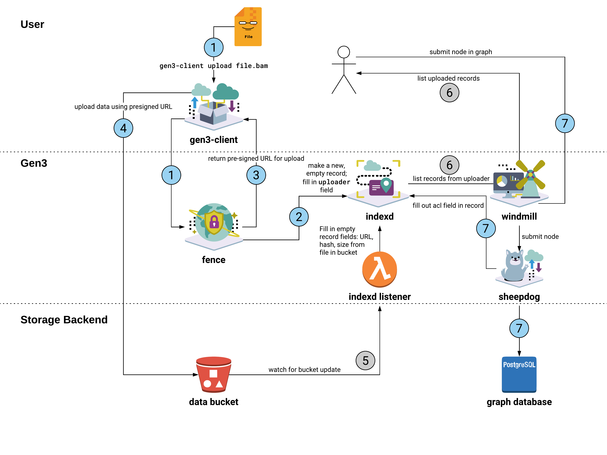

# Data Upload

This document describes the architecture for the data upload flow which the Gen3
stack supports. 

## User Flow

1. User uses `gen3-client` to upload files.
2. User browses uploaded, but not-yet-registered files in windmill, or using the
   client, and registers them in the graph via metadata upload (assuming the
   user has the appropriate authorization).
3. Now that the files are registered in the graph, they are accessible to other
   users with sufficient authorization.
   
   

  
   

## Backend Flow

This diagram illustrates the interactions involved in the data upload process,
starting from a user uploading a file and later accessing it through windmill.

  

Here is further explanation which describes each step of the diagram in detail.

1. The user uploads a file using the Gen3 client.
2. Fence creates an "empty" record in indexd, containing only the GUID, the file name and an
   `uploader` field identifying this user. (At this stage the record is missing
   the checksum and file size.)
3. Fence generates a presigned URL for upload to the data bucket. The path for
   the file is `<GUID>/<filename>`.
4. The user uploads their file to the data bucket directly using the presigned
   URL.

At this stage, now the data file exists in the Gen3 system, and we must update
indexd to complete its information about this file. This next step is grayed
because it happens asynchronously.

5. An AWS SNS is watching the data bucket for new data uploads. When a new file is uploaded to the bucket, the SNS sends a message to an SQS, which is being watched by the listener. The listener identifies the GUID from the filename in the bucket and sends the information about this file to indexd, which completes the record to include checksum and size.

Again this next step is grayed because it can happen at any point in the flow
and is separate from the rest of the steps.

6. A user browses their uploaded records, using either windmill or the Gen3
   client which will query indexd for records with the `uploader` field matching
   this user. (In the diagram only the flow with windmill is shown.) If the
   indexd listener lambda has already checked this file and added the file size
   and hash, then the portal or client indicates that the object is ready for
   registration in the metadata graph. Otherwise, the file shows as not yet
   ready for metadata submission.

The final step.

7. A user submits a metadata node into the graph associated with the original
   data file (again using either windmill or the Gen3 client). If the user is
   trying to submit a metadata node for a data file which the indexd listener
   has not yet registered, sheepdog returns an error.

Now, the original data file is associated with the standard access controls
which apply to the metadata file. This allows other users with sufficient
authorization to access the data file through the client or through windmill.
