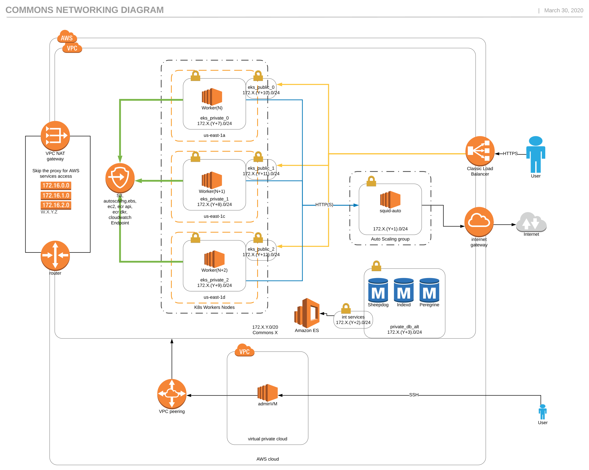
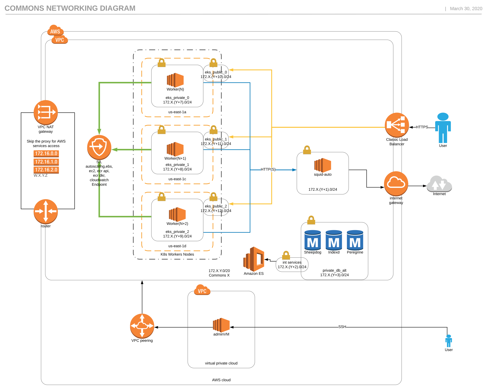

# TL;DR

The following document shows the different network arrangement for commons cluster.

## Overview

Currently there are three ways to deploy commons, well better said, three ways to arrange the subnets allocation.

However, you can only use VPCs with a /20 CIDR

## 1. Use /24

The network would be distributed like the following if `192.168.144.0/20` is used as VPC CIDR:

Subnet Name | Subnet
 --- | ---
public | 192.168.144.0/24
ha-squid | 192.168.145.0/24
int_services | 192.168.146.0/24
private_db_alt | 192.168.147.0/24
eks_private_0 | 192.168.151.0/24
eks_private_1 | 192.168.152.0/24
eks_private_2 | 192.168.153.0/24
eks_public_0 | 192.168.154.0/24
eks_public_1 | 192.168.155.0/24
eks_public_2 | 192.168.156.0/24

## 2. Use /23

The network would be distributed like the following if `192.168.144.0/20` is used as VPC CIDR:

Subnet Name | Subnet
 --- | ---
public | 192.168.144.0/24
ha-squid | 192.168.145.0/24
int_services | 192.168.146.0/24
private_db_alt | 192.168.147.0/24
eks_private_0 | 192.168.148.0/23
eks_private_1 | 192.168.150.0/23
eks_private_2 | 192.168.152.0/23
eks_public_0 | 192.168.154.0/24
eks_public_1 | 192.168.155.0/24
eks_public_2 | 192.168.156.0/24

## 3. Use /22

The network would be distributed like the following if `192.168.144.0/20` is used as VPC CIDR:

Subnet Name | Subnet
 --- | ---
int_services | 192.168.144.0/25
private_db_alt | 192.168.144.128/25
public | 192.168.145.0/25
ha-squid | 192.168.145.128/25
eks_public_0 | 192.168.146.0/25
eks_public_1 | 192.168.146.128/25
eks_public_2 | 192.168.147.0/25
eks_private_0 | 192.168.148.0/22
eks_private_1 | 192.168.152.0/22
eks_private_2 | 192.168.156.0/22

## Recomendations

Although the default in terraform is to deploy clusters using /24 for eks_private (where the kubernetes workers live), it is advisable to always use /22.

If you later decide to change the subnet distribution, unfortunatelly, new resources might be required, especially the EKS clsuter, meaning than the current one might get destroyed first. So plan accordingly.

