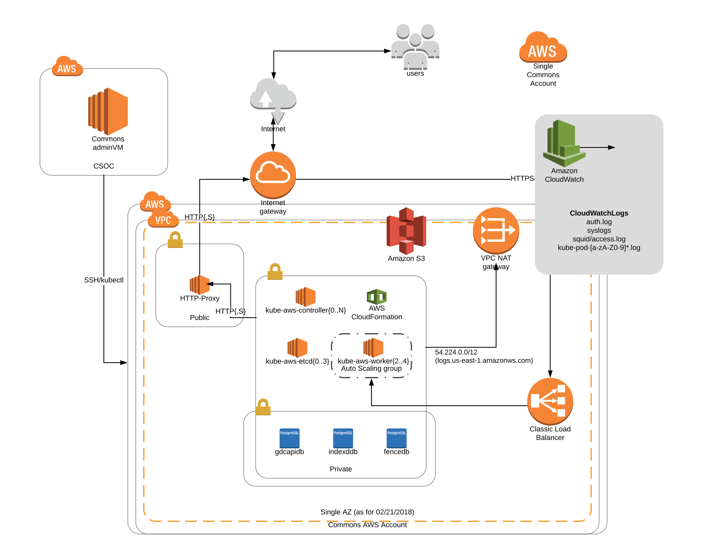

# High level structure

The protected cloud environment setup by cloud-automation currently have 5 subnets.
- A public subnet with internet gateway attached to it, there currently are no VMs on it. The ones that used to belong here were removed by design. The subnets may go away in the near future. Name: public.
- A public subnet that has gateways for external facing services. Right now there is one ELB that routes traffic to services inside k8s cluster. Name: public-kube.
- A private subnet dedicated for k8s cluster which runs all Gen3 services. Name: private-kube.
- A private subnet for users to run analysis. Name: private-user.
- A redundant private subnet for future multi-az setup. Name: private_db_alt.
- A NAT gateway that allows overpassing the proxy for logs.us-east-1.amazonaws.com requests.
