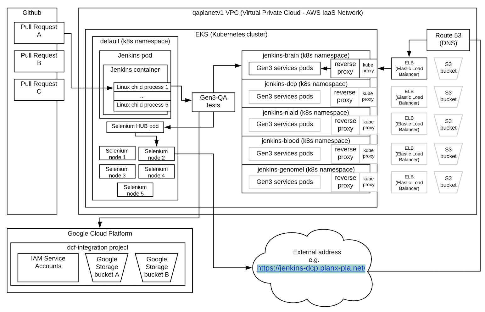

# Selenium Hub

## This diagram describes the new setup:



## How to access the grid console:

On the Dev admin vm:
```
qaplanetv1@cdistest_dev_admin:~$ kc port-forward selenium-hub-75c47cdb96-jhqz9 4444:4444
```

On your local terminal:
```
gen3_lab % ssh -L localhost:4444:localhost:4444 qaplanetv1@cdistest_dev.csoc
```
