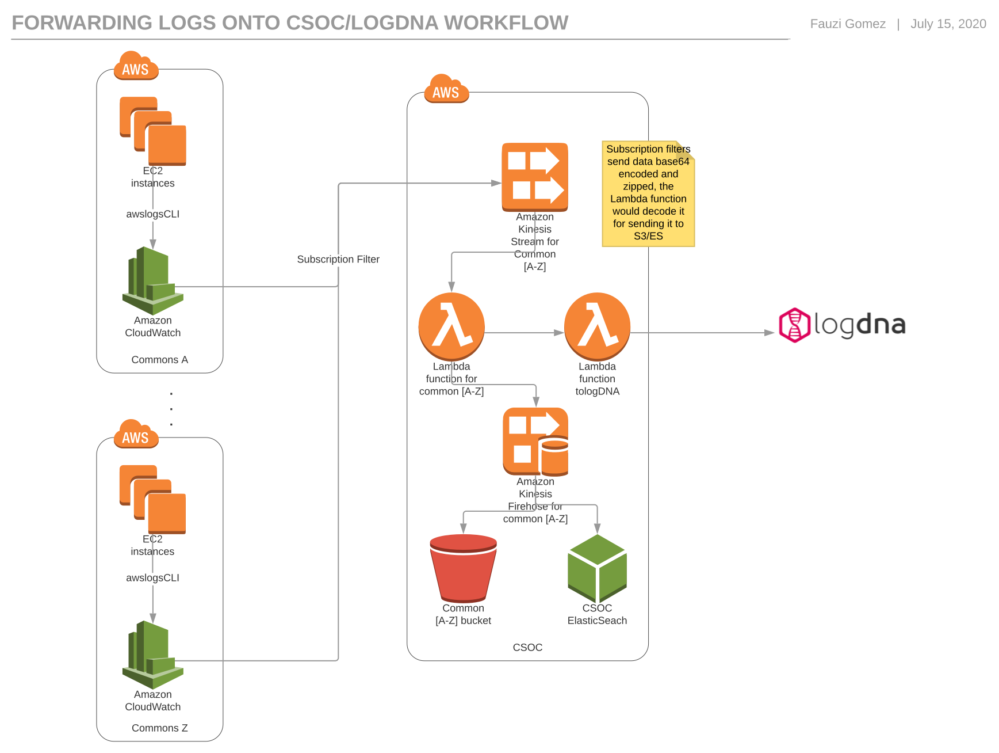

# TL;DR

Centralize logging for all commons in other AWS accounts

## 1. QuickStart

```bash
gen3 workon csoc <commons account>
```

## 2. Table of Contents

- [1. QuickStart](#1-quickstart)
- [2. Overview](#2-overview)
- [3. Centralized  logging](#3-centralized-logging)
  - [3.1 How it works](#21-how-it-works)
    - [3.1.1 JSON breakdown](#311-json-breakdown)
- [4. Variables](#4-variables)
  - [4.1 Required Variables](#41-required-variables)
  - [4.2 Optional Variables](#42-optional-variables)

## 2. Overview

The CSOC account is conceptualized to represent a centralized management account for all commons account. The commons account, conceptually, would act like child accounts for CSOC.

## 3. Centralized logging

For each commons account, every VM living within it, is supposed to send logs to CloudWatchLogs for later analysis, security, control, etc.

This CSOC account will also collect all those logs generated by its child accounts, for a more easy way to browse them all if required without needing to log into each account.

Additionally, logs are also sent to ElasticSearch and S3 simultaneously. ElasticSearch offers Kibana as part of the service, which makes it super easy to filter/query/analyze all those logs through indices.



[Figure 1] Image of workflow reflects how the logs are sent from different accounts into the CSOC account and how the process is.

### 3.1 How it works

When logs come in through the data stream service, it comes base64 encoded and zipped. We need to process it before sending it to ElasticSearch, otherwise it won't be properly interpreted and ultimately won't be inserted and create an index.

An example on what is received:

```json
{
  "Records": [
    {
      "eventID": "shardId-000000000000:49545115243490985018280067714973144582180062593244200961",
      "eventVersion": "1.0",
      "kinesis": {
        "approximateArrivalTimestamp": 1428537600,
        "partitionKey": "partitionKey-3",
        "data": "H4sIAAAAAAAAAO1T227jNhD9FUJPCRrKvEmkBLRAgGbTlwUKxG+RYVDiKCYiS6pIZxFk/e8dyU6yl7ZAsa8L6YGcC+fMzDkvyR5CsA+wfh4hKZPfr9fX2483d3fXtzfJVTJ86mFCs2Za55rnTBiN5m54uJ2Gw4geB09jZ3uIT/zkuIsT2D16Hg81TOiAkD7ZKUVX2gx9tB6fDGnYAYxueKAOxm543kMfKccaGZMiM7QXsnncjjvfdT5s34OtyiBvmZNGKyFB2ZxJqUVmJbDGMCNtbiSvXWObnGesyXhmWtnaVqu8reWMAmGGQx2ayY/RD/0H30UElJT3X/ay/TIk2Syd3TwhyDnwJfEOG5SykNrkSknJMiGM4YWRKjOGKaG55pIJmYsiMwXXMjOZVgZvuUEA0ePYo93jBHkmuBG50ooxdvW6Dnz+pZqLVklZJfejdyUR5rMdx5KwzxP8VRJeyHwlMHVDOEsFfpxcXJIXqQjOOxDfE1lwUj/jBo7k/sPkyUc7ESEJ16VU+BPBuNmQ25s1WW0RTjwE8utv5AFwQzaCI/qUPT+lyD5AE8jFH+v1nyuOtQRjl0SQHVgHp3LanOMvOAmffGx2eB560gwTEHZZVX2VXFVJWBiyNBYi5k6L1Q3NI+CxxL7feLL1bon70b1XyRFLvDPy2zK93cMJ0JlpC6TZGkbbwLv/zMjFPQ7u+8T/4vNb1rkrW7SidUVBhZMZ5RwMtbnIKINGM9PyrHZmyelsDd0ZNFLge6QO17VYkU0s50Yb+VqMRtgjqyPQnQ27U9AbrtNcdkOIi8OPiFlQoWieU61SaETqe5RHb7vlvb0NeNsepm6J38U4hnK1Qv7JlKW8RC2s7Oi/md653VY6C7rmlNfK/mu7xyNi+jGFFf9fYZTM372QK9TIatZF+aaSXzCNbUhVVclXUnlVwuyY1YBymY90uS/RA50nRJvOIx1eQ/9ZBsMh/pTBTxl8JYPN8W+2lRG/nwcAAA==",
        "kinesisSchemaVersion": "1.0",
        "sequenceNumber": "49545115243490985018280067714973144582180062593244200961"
      },
      "invokeIdentityArn": "arn:aws:iam::EXAMPLE",
      "eventName": "aws:kinesis:record",
      "eventSourceARN": "arn:aws:kinesis:EXAMPLE",
      "eventSource": "aws:kinesis",
      "awsRegion": "us-east-1"
    }
  ]
}
```

[Table 1] Example of data received through streaming service

The actual data from child account is in the `data` part of the above JSON, the rest is added by the service which is also nice to have. The lambda function takes care of decoding the data and make it nice for ElasticSearch.

Logs are being sent to S3 as well. There are multiple ways to store the data into S3, as it comes from the stream, or processed the same way we do for ElasticSearch. As for now, we are processing it so we don't need to decode/uncompress if we want/need to see the content.

It worth mentioning that each common would have its own Kinesis Stream, lambda function, Firehose, and S3 logging bucket. ElasticSearch endpoint is just one. The reason for this is to have more control when it requires to filtering, we can query ES easily and not the same for files within S3. And also, things are automates so, Why not?

#### 3.1.1 JSON breakdown

When data comes in, it's in form of Records, which is basically an array (list in python). Said array can be as long as it wants.

- eventID - an Id given by kinesis which also add the shardID in use.
- eventVersion - self explanatory.
- kinesis - this is what actually comes in from the other account.
  - approximateArrivalTimestamp - timestamp when the stream reaches Kinesis.
  - partitionKey - yet another key value, not really helpful.
  - data - the data we want to decode and actually log into ES/S3
  - kinesisSchemaVersion - yet another version
  - sequenceNumber - an unique number for internal controls. A Kinesis thing.
- invokeIdentityArn - who invoked the stream (an AWS role ARN).
- eventName - self explanatory
- eventSourceARN - the stream ARN
- eventSource - self explanatory
- awsRegion - requires no explanation.

For more deep info of what comes in and how it is formatted, please checkout the lambda_function.py file.

## 4. Variables

### 4.1 Required Variables

| Name | Description | Type |
|------|-------------|:----:|
| child_account_id | Account id where the subscription filter lives | string |
| common_name | Name of the commons | string |

### 4.2 Optional Variables

| Name | Description | Type | Default |
|------|-------------|:----:|:-----:|
| csoc_account_id | Account id where resources will be deployed | string | "433568766270" |
| child_account_region | Region for the child account | string | "us-east-1" |
| aws_region | Regions where resources will be deployed | string | "us-east-1" |
| elasticsearch_domain | ElasticSearch domain where logs will be sent | string | "commons-logs" |
| threshold | Threshold for how long response time is accepted, otherwise an alert is triggered. This threshold is a value within the actual lambda function that process logs | string | "" |
| slack_webhook | Where to send alerts | string | "" |
| timeout | Timeout threshold for the lambda function to wait before exiting | number | 300 |
| memory_size | Memory allocation for the lambda function | number | 128 |
