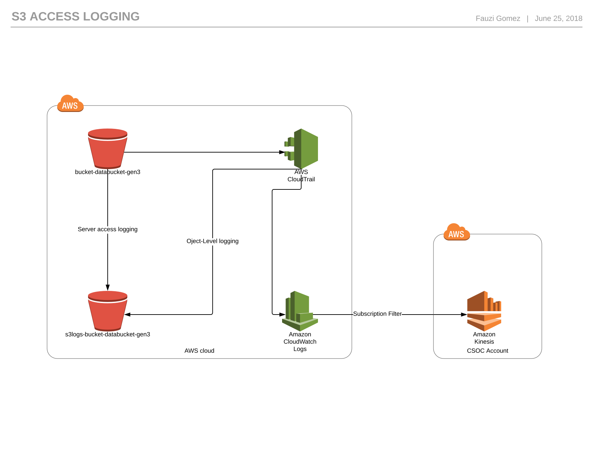

# TL;DR

Terraform module that creates an S3 data bucket:

* a single private S3 bucket with encryption enabled
* a policy that can read from that bucket
* a policy that can read from and write to that bucket
* a read role
* a read+write role
* a read instance-profile
* a read+write instance profile
* a `cdis-s3-logs` access logs bucket

As of 06/21/2018, buckets created this way must be tied to a common in specific.

In the config.tfvars, the environment variable should be set to a CloudWatch Log group already existing, otherwise this might error out.

[lucichart link](https://www.lucidchart.com/invitations/accept/04b7cce8-de11-45e1-aaba-b77258276319)
