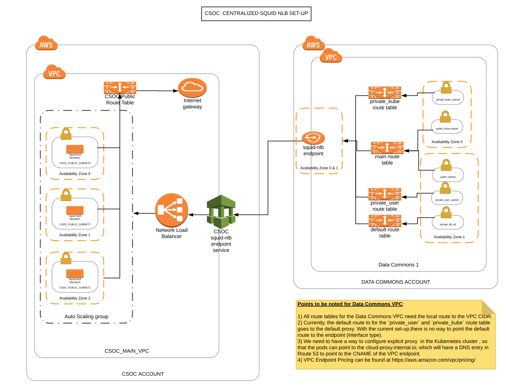

## Description
A centralised NLB set-up for Squid proxy will be installed in the CSOC account. This is going to be a centralised squid set-up utilized by all the data commons VPC.



## Motivation
The nodes in the Data Commons VPC do not have a direct internet access. All the egress traffic is supposed to go via a squid-proxy. A squid-proxy set-up gives us a single point to control and log all the internet access of the commons. Currently, we have a single VM running squid-proxy service in each of the data commons, which makes it a single point of failure and difficult to manage. We are spinning up a multi-az squid-proxy cluster behind a NLB integrated with a autoscaling capability. This gives us a centralised squid set-up which is easier to manage.

## Current Concerns
1) If the users in a particular data commons have a requirement of large data downloads via the squid proxy; we need to look into spinning up decentralised squid NLB cluster for those data commons; so that the cost of managing the squid NLB set-up to support large data downloads is not incurred by the CSOC account.
2) Currently, the default route to for the ```private_user``` and ```private_kube``` route table goes to the default proxy. With the current set-up, there is no way to point the default route to the endpoint (interface type). Check the ```Routing Options``` section in ```https://docs.aws.amazon.com/AmazonVPC/latest/UserGuide/VPC_Route_Tables.html#RouteTables```
 We need to have a way to configure explicit proxy  in the Kubernetes cluster, so that the pods can point to the ```cloud-proxy.internal.io```; which will have a DNS entry in Route 53 to point to the CNAME of the VPC endpoint.
4) VPC Endpoint Pricing can be found at ```https://aws.amazon.com/vpc/pricing/```


## Setting up the squid NLB in CSOC
To launch a squid-nlb central set-up, we run the following from the csoc master admin VM

```gen3 workon <aws-account-name> <squidnlbname>_squidnlbcentral```

This launches a NLB with a target group pointing to VMs running squid-proxy service. A squid version of ```squid-4.0.24``` is running on these VMs. Listeners and target groups corresponding to ```port 3128``` and
```port 22```  are created to handle HTTP/HTTPS traffic and SFTP traffic respectively. Currently, the autoscaling group has a desired capacity of 3, hence
at any point of time, we expect a cluster of three squid proxies each running in a different AZ environment. The squid-proxy cluster can be scaled up/down as per the requirement.

## Updating the squid whitelist and the authorized keys list
Following steps need to be followed, whenever there is a requirement to whitelist a web URL or add a user key to access SFTP server via squid.
1) For updating the whitelist: The web whitelist files under ```~/cloud-automation/files/whitelist``` needs to be updated.
1b) For updating authorized keys: The ```squid_authorized_keys_user``` file under ```~/cloud-automation/files/authorized_keys``` needs to be updated.
2) A PR needs to created and approved to push the changes to the master.
3) There is a cronjob which runs every 15 minutes on the squid-proxy VM, which checks for any change in the whitelist or the authorized
keys in cloud-automation folder and update the local files in case of any changes. Therefore, whenever a change is pushed, a maximum period of 15 minutes should be expected to have it in effect.


## SFTP access via the squid-proxy set-up
To access the SFTP server; something similar to the following needs to be added to the ssh config file. Please note the `sftpuser` which needs to be used to access the SFTP via squid-proxy cluster.

```Host sftp.server
         ServerAliveInterval 120
         HostName sftp.server.xxx.net
         User foo
         ForwardAgent yes
         IdentityFile ~/.ssh/id_rsa
         ProxyCommand ssh sftpuser@cloud-proxy.internal.io nc %h %p 2> /dev/null```


