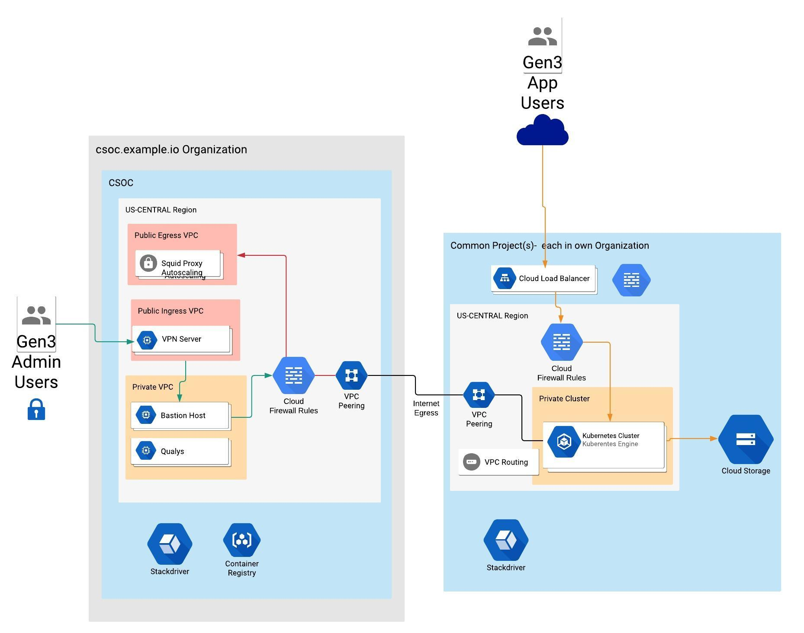

# Envrionment Overview

# Table of Contents

1. [ Architecture ](#architecture)
    * [Seed-Project](#seedproject)
    * [Network Design](#network)
    * [VPC Desgin](#vpc)
    * [Logging](#logging)
    * [Terraform State](#terraform)
1. [ About GCP CSOC ](#csoc)
1. [ About GCP Commons](#commons)
1. [ Requirements ](#requirements)

# Architecture

The CSOC stands for Commons Services Operations Center. A Commons, is another Google Cloud Identity. It will have it's own `admin console`, this a completely separate organization. The CSOC is there to help manage and audit any additional Commons Cloud Identities.

## Seed-Project
This overview assumes that this work will be done from a new Cloud Identity in GCP. A service account will be used by Terraform to provision the necessary infrastructure, but a project must be created before a new service account can be created. The reason is because service accounts cannot be created at the organization level, it has to be part of a project. This "Seed-Project" can be a one-time manual process or use native gcloud commands to create the account. The diagram does not depecit this, because it's sole purpose is to manage the other projects using the Terraform service account. It will also house the [Terraform State](#terraform). Each organization will have a "Seed-Project".

## Network Design
The CSOC is composed of three different VPCs. These VPCs are all peered together and security is controled through service accounts and firewall rules. 
1. All inbound traffic comes through the VPC labeled `ingress`.
1. All outbound Internet access will be restricted to the Squid proxies, hosted in the `egress` VPC.
1. The `private` VPC is used for private access for administrative and support purposes with the different Commons organizations.

## VPC Design
A VPC peer is created between all the CSOC VPCs and controlled with firewall rules. A VPC peer is also established between the Commons VPC and the `private` VPC in the CSOC. A second VPC peer is also established between the Commons and the `egress` which resides in the CSOC.

## Logging
Stackdriver is used for logging all activity in the envrionment. These logs are stored in a bucket, located with the "Seed-Project".

## Terraform State
The Terraform state files are located in a bucket, located with the "Seed-Project". Each organization will have a `Terrafrom-state` bucket.

# About GCP CSOC

CSOC stands for Commons Services Operations Center, which is a term used internally to refer to our centralized operation center for multiple commons. This Cloud Identity is used for central administration, support, logging, and auditing.

CSOC Administrators gain access into the environment to help support the Commons. Qualys is used as a scanning tool to audit the envrionment and for security scans. Squid managed instance groups are used to filter outbound internet traffic. Google Container Registry is used to provide private image management that's used for the Kubernetes clusters that live in each Commons.

A VPC peer is created between the CSOC and Commons for administrative tasks as well to monitor outbound internet traffic.

Visit [CSOC Documentation](roots/csoc_setup/readme.md) for more information on how to build.

# About GCP Commons

Commons is a separate Cloud Identity / Organization that is attached to the CSOC Cloud Identity so it can be centrally managed, logged and audited. A GKE Cluster is provisioned in each Commons to run the Gen3 application. All outbound traffic is routed through the Squid Managed Instance group that sits in the CSOC.

The Commons needs to be able to read the contents from the CSOC so Commons can build with a no-touch approach. In order to do this, the Terraform service account (SA) that was provisioned for Commons, needs to be added to the CSOC.

Visit [Commons Documentation](roots/commons_setup/readme.md) for more information on how to build.

# Requirements
## Before you begin

This document will assumes you already have a Cloud Platform account set up for your organization and that you are allowed to make organization-level changes in the account.

Changes to the environment are preformed using tools like Google Cloud SDK gcloud, Terraform, and shell scripts to make certain deployments easier.
