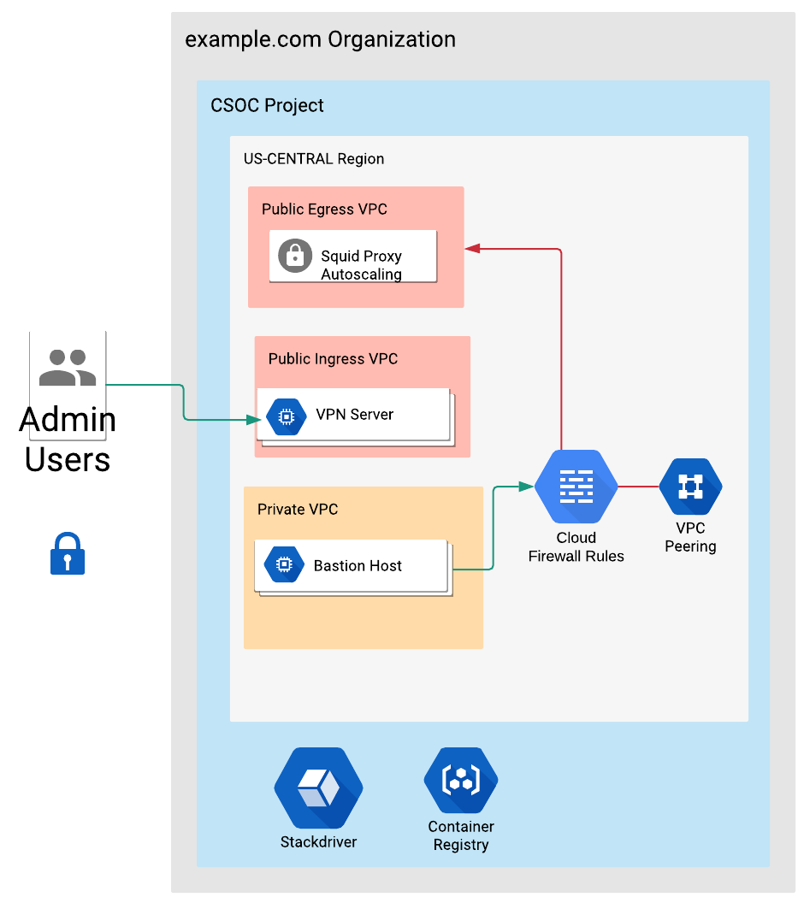

# Build a new CSOC
Boostrap scripts and Terraform scripts to spin up a new CSOC in GCP.


## Overview


Below is the outline of how to build a new CSOC.

### Quick Start
1. <code>git clone</code> this repo to Google Cloud Shell.
1. Install [Terraform](https://www.terraform.io/).
1. Create a "Seed-Project"
1. Run the [setup-sa script](https://github.com/uc-cdis/cloud-automation/blob/master/tf_files/gcp-bwg/scripts/setup-sa.sh) to create service account, bucket for Terraform backends, and the required APIs.
1. Open the <code>[answerfile-csoc_setup-001.template.tfvars](https://github.com/uc-cdis/cloud-automation/blob/master/tf_files/gcp-bwg/roots/templates/answerfile-csoc_setup-001.template.tfvars)</code>, set the variables specified with a "<>", and fill in any other variables you set fit to change.
1. Rename the <code>[answerfile-csoc_setup-001.template.tfvars](https://github.com/uc-cdis/cloud-automation/blob/master/tf_files/gcp-bwg/roots/templates/answerfile-csoc_setup-001.template.tfvars)</code> file and replace the <code>template</code> with the name of the user running the script.
1. Copy the <code>[answerfile-csoc_setup-001.template.tfvars](https://github.com/uc-cdis/cloud-automation/blob/master/tf_files/gcp-bwg/roots/templates/answerfile-csoc_setup-001.template.tfvars)</code> file from the template directory to <code>[csoc_setup/variables](https://github.com/uc-cdis/cloud-automation/tree/master/tf_files/gcp-bwg/roots/csoc_setup/variables)</code> directory.
6. Run <code>[make](https://github.com/uc-cdis/cloud-automation/blob/master/tf_files/gcp-bwg/roots/csoc_setup/makefile) plan</code> from <code>csoc_setup</code> directory. Pass in the TENANT variable which looks like
```tf
make plan TENANT=001
```
7. Run <code>[make](https://github.com/uc-cdis/cloud-automation/blob/master/tf_files/gcp-bwg/roots/csoc_setup/makefile) apply</code> from <code>csoc_setup</code> directory. Pass in the TENANT variable which looks like
```tf
make apply TENANT=001
```
8. Run <code>[make](https://github.com/uc-cdis/cloud-automation/blob/master/tf_files/gcp-bwg/roots/csoc_setup/makefile) destroy</code> from <code>csoc_setup</code> directory. Pass in the TENANT variable which looks like
```tf
make destroy TENANT=001
```

## Before you begin
This document will assumes you already have a Cloud Platform account set up for your organization and that you are allowed to make organization-level changes in the account.

Changes to the environment are preformed using tools like Google Cloud SDK gcloud, Terraform, and shell scripts to make certain deployments easier.

# Create a "Seed-Project"
Use the GCP cloud shell and export the following variables to your environment.

```tf
export TF_VAR_org_id=YOUR_ORG_ID
export TF_VAR_billing_account=YOUR_BILLING_ACCOUNT_ID
export TF_SEED_PROJECT=seed-project-${USER}
```

You can find the values for YOUR_ORG_ID and YOUR_BILLING_ACCOUNT_ID using the following commands:
```tf
gcloud organizations list
gcloud beta billing accounts list
```

## Create the Terraform Seed-Project
Using a Seed Project for your Terraform service account keeps the resources needed for managing your projects separate from the actual projects you create. Create a separate project and service account exclusively for Terraform.

```tf
gcloud projects create ${TF_SEED_PROJECT} \
    --organization ${TF_VAR_org_id} \
    --set-as-default

gcloud beta billing projects link ${TF_SEED_PROJECT} \
    --billing-account ${TF_VAR_billing_account}
```

# Run setup-sa Script
Create the service account used in the Terraform seed project, download the JSON credentials and create the bucket where Terrafrom state will live.

### Script Helper
A [helper script](https://github.com/uc-cdis/cloud-automation/tree/master/tf_files/gcp-bwg/scripts/setup-sa.sh) is included to create the service account in the Seed Project. The setup script will grant the necessary roles to the Service Account, enable the necessary API's in the project, create a new bucket to store the Terraform state and as download the service account JSON file and store it in the bucket. Last the script will provision a new compute instance to be used to manage the environment.

Run it as follows

```tf
./setup-sa.sh ${TF_VAR_org_id} ${TF_SEED_PROJECT} $[TF_VAR_billing_account]
```

### Service Account Created
A new service account will be created with the name of project-factor-[random_id]@{TF_SEED_PROJECT}.iam.gserviceaccount.com

### Bucket Created
A new bucket will be created with the name of terraform-state-[random_id]

### Permissions Created
Organization Level Permissions

* <code>roles/resourcemanager.folderViewer on the folder that you want to create the project in.</code>
* <code>roles/resourcemanager.organizationViewer</code>
* <code>roles/resourcemanager.projectCreator</code>
* <code>roles/orgpolicy.PolicyAdmin</code>
* <code>roles/billing.user</code>
* <code>roles/resourcemanager.folderCreator</code>
* <code>roles/compute.networkAdmin</code>
* <code>roles/cloudsql.admin</code>
* <code>roles/iam.serviceAccountAdmin</code>
* <code>roles/storage.admin</code>
* <code>roles/logging.configWriter</code>
* <code>roles/compute.instanceAdmin</code>

### Project Level Permission

* <code>roles/resourcemanager.projectIamAdmin</code>
* <code>roles/compute.imageUser</code>

# Git Clone
Clone the repo to either GCP cloud shell or the newly provisioned VM in the "Seed-Project".

```git
git clone https://github.com/uc-cdis/cloud-automation
```

# Answerfile
A Terraform .tfvars file  will be used to provision the environment and is located in the <code>roots/templates</code> director. The answerfile to use for CSOC is the [answerfile-csoc_setup](https://github.com/uc-cdis/cloud-automation/blob/master/tf_files/gcp-bwg/roots/templates/answerfile-csoc_setup-001.template.tfvars) file.

## Answerfile file naming structure

The answerfile file name is structured in a specific way. The template is named: <code>[answerfile-csoc_setup-001.template.tfvars](https://github.com/uc-cdis/cloud-automation/blob/master/tf_files/gcp-bwg/roots/templates)</code> This filename is read from a make file. The make file looks for specific parts in the file name.

### User

The <code><b>template</b></code> is telling the make file who is running the file. This needs to be changed based on the username value found running $USER. The answerfile needs to be updated to reflect this change.

### Example
A user running the make script and their username is <code>ubuntu</code>. Change the file to read:

```tf
answerfile-csoc_setup-001.ubuntu.tfvars
```

The idea is so multiple users can have their own .tfvars file.

### TENANT
The tenant section in the filename is <code>001</code>. This can stay the same if you only have one CSOC you're managing. If you have multiple with different values, create a second copy of the answerfile and change the tenent to read:

```tf
answerfile-csoc_setup-002.ubuntu.tfvars
```


## Terraform State Variables
Comment blocks break out the template into the different steps the environment will provision. Any value marked with <code>< ></code> needs to be replaced with true values in the environment. The other values can be left alone if desired.

The comment block labeled <code>TERRAFORM STATE VARAIBLES</code> has false variable values that need to replaced with information that's true in your environment.

Replace <code><bucket_name></code> and <code><seed_project_name></code> with true values in your envrionment.
```tf
state_bucket_name = "terraform-state--1234567890"
state_project_name = "my-project-id-here"
```

## Organization Setup Variables
The comment block labeled <code>Organization Setup</code> has false variable values that need to replaced with information that's true in your environment.

Replace <code><organization_name></code>, <code><org_id></code>, <code><billing_account></code>, <code><desire_project_name></code>, <code>< region></code>, and <code><path_to_credential_file></code>

```tf
organization = "example.com"
org_id = "987654321"
billing_account = "1111-2222-3333"
credential_file = "credential.json"
env = "csoc"

project_name = "my-new-project"
region = "us-central1"
```

## Project Setup Variables
The comment block labeled <code>Project Setup</code> has all default values with nothing that needs to change. A couple of areas you may want to change are below: 

* You may chose to change the VPC names or use what's provided in the template.
* You may chose to change the VPC subnetwork IP addresses or use what's provided in the template.

## Application Setup Variables
The comment block labeled <code>Application Setup</code> has false variable values that need to replaced with information that's true in your environment.

Replace <code><openvpn_name></code>,<code><script_location></code>,<code><squid_name></code>,<code><script_location></code>,<code><ssh_user></code>,<code><ssh_key_pub></code>,<code><ssh_key></code>, <code><unique_bucket_name></code>, <code><unique_bucket_name></code>

```tf
openvpn_name = "openvpn"

openvpn_metadata_startup_script = "../modules/compute/scripts/openvpn.sh"

squid_name = "squid"

squid_metadata_startup_script = "../modules/compute/scripts/squid.sh"

ssh_user = "username"
ssh_key_pub = "key_pub"
ssh_key = "key"

bucket_data_access_logs = "bucket_for_data_access"
bucket_activity_logs = "bucket_for_activity_logs"
```

# Run Maker of Makes
The "maker of makes" file is a [script](https://github.com/uc-cdis/cloud-automation/blob/master/tf_files/gcp-bwg/roots/csoc_setup/makefile) that configures the Terraform backend, and calls other make file that lives in each setup folder. There are four setup folders that provision their section of the environment.

The <code>org_policies</code> is called first and it creates any Org Level permissions as well as set the Organization Policies at the organization level.

The <code>org_setup</code> is called to create the folder structure and the project that will live in the folder.

The <code>project_setup</code> builds the infrastructure needed for the project. Items like VPCs, subnetworks, firewalls, and Cloud NAT.

The <code>app_setup</code> builds any applications needed for the project. Items like a bastion VM, admin vm, managed instance groups for OpenVPN and Squid proxies.

## Calling the make file
The make file needs to be called from console and needs to have two values passed to it: the <code>TENANT</code> variabled and the <code>answerfile</code> passed to it. The <code>TENANT</code> variable is used so multiple answerfiles can be used per different environment. Make sure the answerfile filename is named correctly.

Example
Perform the following commands on the root folder where make is located:
* <code>make plan TENANT=001</code> to see the infrastructure plan
* <code>make apply TENANT=001</code> to apply the infrastructure build
* <code>make destroy TENANT=001</code> to destroy the built infrastructure
