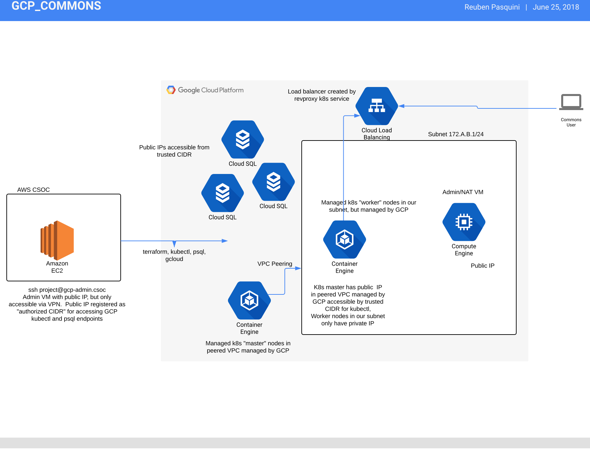

# TL;DR

Terraform scripts for spinning up a commons in GCP.

# Setup GCP service accounts

* Create a new `vpc_name` GCP project for the commons.
Remember to associate a billing account with the new project.
* Create a new `gen3-terraform-iam` role with the following permissions:
    - iam.serviceAccounts.get
    - iam.serviceAccounts.list
    - resourcemanager.projects.get
* Create a `gen3-terraform` service account, and register its credentials with `gen3`.
  The `gen3-terraform` account should be given the following IAM roles:
    - Compute admin
    - Compute storage admin
    - Kubernetes engine admin
    - Storage Admin
    - Cloud SQL Admin
    - `gen3-terraform-iam`

* this may go away: create a `gen3-k8s-admin` service account (to associate with the in-cluster VM)
with the following roles:
    - Cloud SQL Admin
    - Compute Admin
    - Kubernetes Engine Admin
    - Logging Admin
    - Monitoring Admin
    - Storage Admin
Add `gen3-terraform` as a iam.serviceAccountUser member on the service account

* create a `gen3-k8s-node` service account (to associate with k8s nodes) with the following roles:
    - Cloud SQL Client
    - Cloud SQL Viewer
    - Compute Instance Admin (v1)
    - Logs Writer
    - Monitoring Metrics Writer
    - Storage Admin
Add `gen3-terraform` as a iam.serviceAccountUser member on this service account

* Download the `credentials.json` file for the `gen3-terraform` service account
to the adminvm `vpc_name@gcp.csoc`, and register it as a `gcp-X` profile with `gen3`:
```
download `credentials.json` from GCP console
gen3 cd config
cp path/to/credentials.json gcp/gcp-profile.json
gen3 workon gcp-profile prodcommons
gen3 cd
...
```

# Run terraform

The `gen3` scripts are configured to treat each profile starting with `gcp-` as
a Google Cloud profile.  Our GCP terraform scripts and modules live in the `cloud-automation` repository under the `tf_files/gcp/` folder.

```
$ gen3 cd
$ edit config.tfvars
$ gen3 tfplan
$ gen3 tfapply
```

Terraform builds up an environment that looks like this:



# Setup kubernetes environment

Until our in-CSOC GCP admin vm is ready we have an in-VPC admin VM in GCP.

```
$ gcloud compute --project "dev-commons" ssh --zone "us-central1-a" "dev-commons-admin"
$ add keys to admin box, and logout

# Note that we cannot ssh out of the old AWS admin VM's, so you can do one of the following
# to establish an initial ssh connection
# until the CSOC gcp-admin vm's with public IP are available:
#   - ssh from your laptop
#   - ssh via the gcp web console

$ scp -r {vpc_name}_output/ admin-ip:{vpc_name}  # copy config files to gcp admin vm
$ ssh to admin-box
$ git clone https://github.com/uc-cdis/cloud-automation.git
$ git clone https://github.com/uc-cdis/cdis-manifest.git
$ export vpc_name=THE-NAME
$ export GEN3_NOPROXY=true
$ bash cloud-automation/gen3/bin/kube-setup-workvm
$ source ~/.bashrc  # to get gen3 helper in shell
$ gcloud container clusters get-credentials {VPC-NAME} --zone us-central1-a --project {GCP-PROJECT-NAME}
$ kubectl get nodes
$ verify secrets are properly configured under ~/$vpc_name
$ verify that a manifest is properly configured under ~/cdis-manifest
$ gen3 roll all

```

# GCP CSOC admin

We intend to run a single GCP adminvm in the AWS CSOC for all the different GCP commons.
An operator logs into a particular VM user account to interact with a particular
GCP commons' GCP project, kubernetes cluster, SQL databases, and other resources - ex: `ssh gcp-commons@gcp.csoc`

GCP Kubernetes and Cloud SQL have the notion of "master authorized networks" - which are just external CIDR ranges that
can directly access a k8s master or a SQL db, so our GCP adminvm is a special VM
in a public subnet with a public IP and a route to the internet gateway, and a security group that only allows ingress from the VPN.  I ssh to `gcp-commons@gcp.csoc`, where:
* we'll have GCP service-account credentials for running the `gcloud` cli and terraform against the GCP project
  associated with the commons (every commons maps to a GCP project)
* we'll whitelist the public IP of gcp.csoc on our GCP k8s and SQL resources, so we can run `psql` and `kubectl`Anyway - that's one way to do things - what do you think?
* links
    - https://www.terraform.io/docs/providers/google/r/sql_database_instance.html#value-1
    - https://cloud.google.com/kubernetes-engine/docs/how-to/authorized-networks
    - https://www.terraform.io/docs/providers/google/r/container_cluster.html#master_authorized_networks_config
